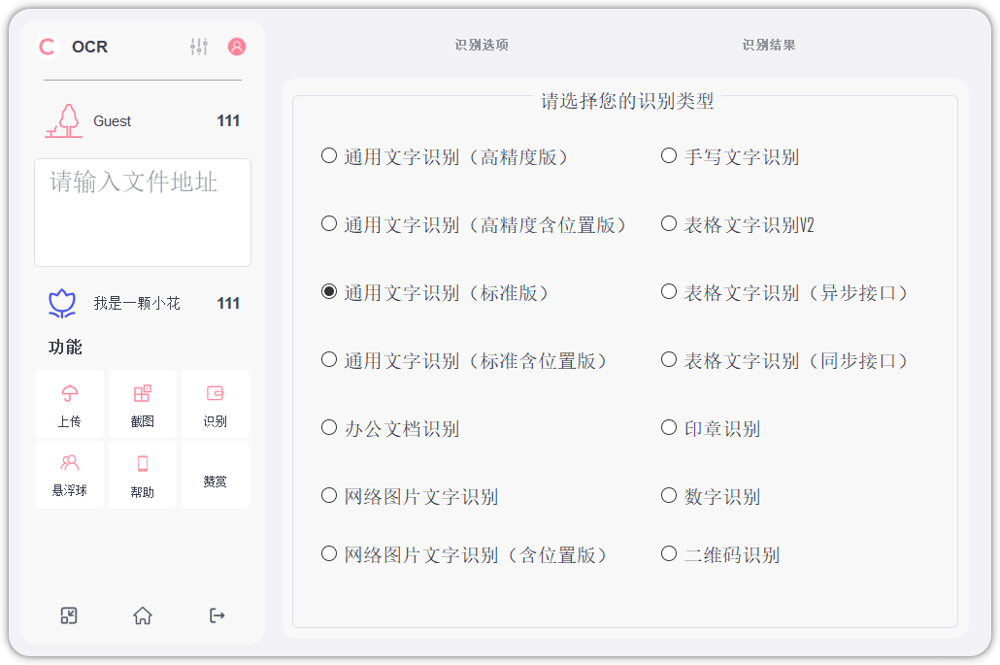

# 小羊咩咩OCR
[TOC]
## 简介

小羊咩咩我们小组开发的一款OCR软件，根据软件工程课堂所学内容，结合 [百度云AI开放平台 ](https://ai.baidu.com/tech/ocr/)与 [华为云数据库](https://activity.huaweicloud.com/)，用户提供在线文本提取功能。它具有简洁美观、容易扩展、使用方便的特点，在满足基本OCR使用要求的同时，尽可能优化使用体验。

在设计上，采用经典的面板设计，用户登录后，在这里选择需要使用的功能。输入文件路径，点击识别即可完成基本操作。



为简化用户操作，减少屏幕空间，我们还设计了悬浮球模式。悬浮球一只像云朵的绵羊，用户可以拖动它到任意位置。双击小羊可使用截图功能，以供后续识别。右键小羊选择其他功能。

  

在开发上，松耦合的开发为后续的扩展提供可能。我们将每个功能单独封装成模块，每当有新的变动都不会影响其他模块。无论是添加、删除还是修改，都可以很方便地进行。如果以后有机会，我们还会在上面添加更多的功能。


## 安装

编译运行我们的软件需要配置编译环境。如果您想立即体验我们的小羊咩咩OCR，您可以直接安装我们软件的release版。我们已将程序打包好，但安装版仅支持在 Windows 上运行。

## 编译须知

若您想从源码编译运行，请确保配置以下环境：
- 本项目基于QT 5.14.2 开发，编译运行时请确保QT版本大于等于5.14.2。
- 本软件以https发送请求，因此需要安装openssl库，点击[这里](https://www.openssl.org/)下载。(如果QT是通过下载器安装的，也可以从 ```....(QT的安装目录)/QT/Tools/mingw730_64/opt/bin``` 目录下, 将```libeay32.dll``` 和 ```ssleay32.dll``` 拷贝到.exe文件的生成目录下)
- 本软件以MySQL数据库作为存储部分，编译时请将 [MySQL官方](https://dev.mysql.com/) 驱动库中的```....(MySQL的安装目录)/lib/``` 下的 ```libmysql.dll``` 放到编译生成目录。详细配置教材请参考 [这里](https://blog.csdn.net/ysyut/article/details/108038100?ops_request_misc=%257B%2522request%255Fid%2522%253A%2522165081046816782390548548%2522%252C%2522scm%2522%253A%252220140713.130102334.pc%255Fall.%2522%257D&request_id=165081046816782390548548&biz_id=0&utm_medium=distribute.pc_search_result.none-task-blog-2~all~first_rank_ecpm_v1~rank_v31_ecpm-7-108038100.142%5ev9%5epc_search_result_cache,157%5ev4%5econtrol&utm_term=qt%E9%85%8D%E7%BD%AEmysql&spm=1018.2226.3001.4187) 


## 运行须知

本软件的注册登录功能需要连接华为云数据库，但数据库加上公网IP的费用每天需要十几块，我们目前账号的余额仅够支持到2022年5月16日23:50。

如果您在此日期之前运行本程序，您可以直接使用以下账号：

- 用户名：vfish  密码：myOCR666
- 用户名：xuexue  密码：123456
- 用户名：Sugi  密码：13579alsk
- 用户名：lan  密码：lan123456
- 用户名：ljm  密码：ljm


当然，如果您不想注册登录，可以选择 “游客模式” 直接进入即可.


